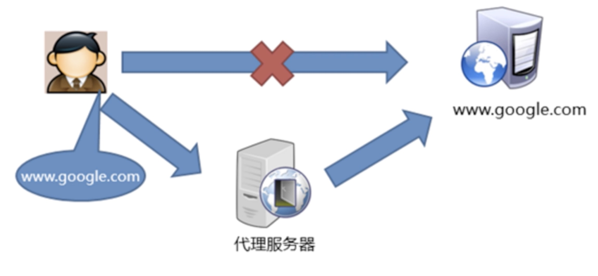

# 代理模式

对于我们学习软件技术的人员来说，通过Google来检索资料就显得非常重要了，但是Google是国外的搜索引擎，由于政策原因，国内这边是无法直接访问的，那该怎么办呢？

这个时候，你就需要翻墙了，比较常用的解决办法是连接一个VPN，简单理解的话，他就是一个第三方的网络转发平台，这个平台可以在境外，比如香港等地区，但是国内的用户可以访问，然后这个平台可以将国内用户的访问转发到国外的搜索引擎中，类似于一个"网络代理"的身份。

这种方式就是我们软件中常用的***代理模式***，当我们需要访问一些不可以直接访问的资源的时候，可以通过一个`代理`，让这个代理替代我们访问资源，对我们来说，就和直接访问该资源一样。

## 模式定义

***代理模式是一种结构模式，为其他对象提供一种代理以控制对这个对象的访问***。在某些情况下，一个对象不适合或者不能直接引用另一个对象，而代理对象可以在客户端和目标对象之间起到中介的作用，为客户端提供控制源对象的引用。

从上面的定义可以看出，代理模式有以下特点：
* 当我们无法直接访问原始对象时，可以通过一个第三方的代理来替代我们访问原对象。
* 当我们需要控制其他对象对某个资源的访问时，我们可以使用代理来进行权限的访问控制。

## 模式结构

主要角色如下：
1. **服务接口(Service Interface)**: 声明了服务接口。 代理必须遵循该接口才能伪装成服务对象。
2. **服务(Service)**: 类提供了一些实用的业务逻辑。
3. **代理(Proxy)**: 类包含一个指向服务对象的引用成员变量。代理完成其任务 （例如延迟初始化、 记录日志、 访问控制和缓存等） 后会将请求传递给服务对象。 通常情况下， 代理会对其服务对象的整个生命周期进行管理。
4. **客户端(Client)**: 能通过同一接口与服务或代理进行交互，所以你可在一切需要服务对象的代码中使用代理。

## 适用场景

通常情况下，代理模式使用与以下场景：

*  访问控制(保护代理)
   
如果你只希望特定客户端使用服务对象， 这里的对象可以是操作系统中非常重要的部分， 而客户端则是各种已启动的程序 （包括恶意程序）， 此时可使用代理模式。

* 远程代理
  
适用于服务对象位于远程服务器上的情形, 在这种情形中， 代理通过网络传递客户端请求， 负责处理所有与网络相关的复杂细节。

## 优缺点

### 优点

* 你可以在客户端毫无察觉的情况下控制服务对象。
* 如果客户端对服务对象的生命周期没有特殊要求， 你可以对生命周期进行管理。
* 即使服务对象还未准备好或不存在，代理也可以正常工作。
* 开闭原则。 你可以在不对服务或客户端做出修改的情况下创建新代理。

### 缺点

* 代码可能会变得复杂， 因为需要新建许多类。
* 服务响应可能会延迟。